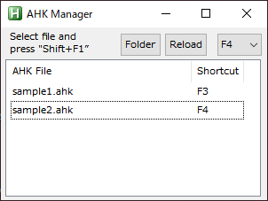

# AHKManager
Manage AHK Script Shortcuts




## Features

- Shortcuts to AHK file can be configured on screen.
- Shortcuts that can be assinged are F1 to F12, Ctrl+F1 to Ctrl+F12.
- You can also type Shift+F1 to execute AHK file instead of setting a shortcut.
- You can edit the file by double-clicking on it.

## Usage

1. Install AutoHotkey.
2. Clone this repository.
3. Place your own AHK file in the same folder as the #AHKManager.ahk file.
4. Double-click #AHKManager.ahk to execute it.
5. Select the AHK file from the list and set up a shortcut.
6. Focus on another window, and then press the shortcut.

## Settings

All settings are written in the .AHKManager.ini file.
If you want to edit a file in your own editor, you can add the following settings to the ini file.

```
[core]
editor=C:\Program Files (x86)\sakura\sakura.exe
```
